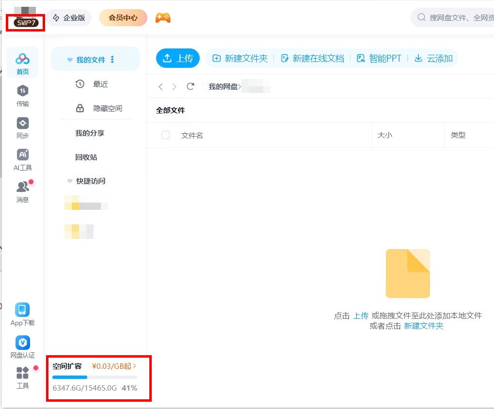

# how-to-download-from-pan-baidu

How to Download Files from Baidu Netdisk?
Downloading files from Baidu Netdisk is a common problem for many people. If you are struggling with downloading from China's Baidu Netdisk, such as not having an account, or having an account but experiencing very slow download speeds because it is not a paid VIP account, you can contact me for a paid download service.

I will provide a quote based on the total number of links, the total size of the files in all the links, and the total number of files in all the links.

Files will be stored on Google Drive by default, so please also provide your Gmail account, and I will share the files with you.

My service is excellent, having served over 10,000 customers with no negative reviews. My advantages are fast speed and great after-sales service.

If you have the above needs, please contact me.

